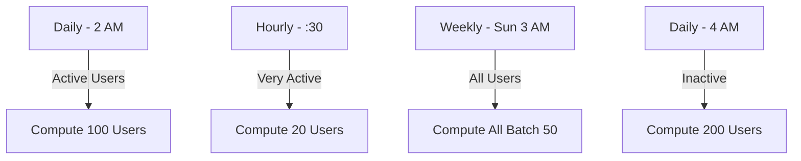

# Recommendation System Documentation

## Table of Contents
1. [System Overview](#system-overview)
2. [Architecture](#architecture)
3. [Scoring Algorithm](#scoring-algorithm)
4. [Data Flow](#data-flow)
5. [Caching Strategy](#caching-strategy)
6. [Scheduling](#scheduling)
7. [Performance Optimization](#performance-optimization)

---

## System Overview

The recommendation system is a **hybrid recommendation engine** that combines:
- **Content-Based Filtering**: Uses user interests and hashtags
- **Collaborative Filtering**: Uses subscriptions, likes, and engagement data
- **Popularity-Based**: Uses engagement metrics (likes, comments, views)

The system operates in **3 tiers** for optimal performance:
- **L1 Cache**: Redis (10 minutes TTL)
- **L2 MongoDB**: Precomputed recommendations (1 hour freshness)
- **L3 Real-time**: Computed on-demand when needed

---

## Architecture

### Component Diagram

```
┌─────────────────────────────────────────────────────────────┐
│                    Recommendation Service                    │
│  ┌───────────────────────────────────────────────────────┐  │
│  │  getPersonalizedFeed()                                 │  │
│  │  ├─> Check Redis Cache (L1)                          │  │
│  │  ├─> Check MongoDB Precomputed (L2)                  │  │
│  │  └─> Real-time Computation (L3)                      │  │
│  └───────────────────────────────────────────────────────┘  │
│                                                               │
│  ┌───────────────────────────────────────────────────────┐  │
│  │  getRecommendedMushrooms()                            │  │
│  └───────────────────────────────────────────────────────┘  │
│                                                               │
│  ┌───────────────────────────────────────────────────────┐  │
│  │  getRecommendedUsers()                                │  │
│  └───────────────────────────────────────────────────────┘  │
└─────────────────────────────────────────────────────────────┘
                           │
                           ▼
┌─────────────────────────────────────────────────────────────┐
│              Recommendation Compute Service                  │
│  ┌───────────────────────────────────────────────────────┐  │
│  │  computeUserRecommendations(userId)                    │  │
│  │  ├─> Fetch User Preferences                             │  │
│  │  ├─> Fetch Stories                                     │  │
│  │  ├─> Score Stories (Algorithm)                         │  │
│  │  ├─> Filter & Rank                                     │  │
│  │  └─> Save to MongoDB                                   │  │
│  └───────────────────────────────────────────────────────┘  │
└─────────────────────────────────────────────────────────────┘
                           │
                           ▼
┌─────────────────────────────────────────────────────────────┐
│           Recommendation Scheduler Service                   │
│  ┌───────────────────────────────────────────────────────┐  │
│  │  Daily Job (2 AM): Active Users (100)                 │  │
│  │  Hourly Job (30 min): Very Active Users (20)          │  │
│  │  Weekly Job (Sun 3 AM): All Users (batch 50)          │  │
│  │  Daily Job (4 AM): Inactive Users (200/day)            │  │
│  └───────────────────────────────────────────────────────┘  │
└─────────────────────────────────────────────────────────────┘
```

### Data Sources

```
┌──────────────┐      ┌──────────────┐      ┌──────────────┐
│  PostgreSQL  │      │   MongoDB    │      │    Redis     │
│              │      │              │      │              │
│ - Stories    │      │ - Precomputed│      │ - Feed Cache │
│ - Users      │◄────►│   Recs       │      │ - TTL: 10min│
│ - Likes      │      │ - Aggregates │      │              │
│ - Subscriptions│    │              │      │              │
│ - Mushrooms  │      │              │      │              │
└──────────────┘      └──────────────┘      └──────────────┘
```

---

## Scoring Algorithm

### Story Recommendation Scoring Formula

The recommendation score for a story is calculated using a **weighted multi-factor scoring system**:

```
Total Score = FollowBoost + MushroomBoost + ContentMatch + Engagement + Freshness
```

#### Algorithm Breakdown

```python
def calculate_story_score(story, user, preferences, aggregate):
    score = 0.0
    
    # Factor 1: Followed Author Boost (30 points max)
    if story.authorId in preferences.subscribedUserIds:
        score += 30
    
    # Factor 2: Subscribed Mushroom Boost (25 points max)
    if story.mushroomId and story.mushroomId in preferences.subscribedMushroomIds:
        score += 25
    
    # Factor 3: Content-Based Matching (20 points max)
    if user.interests and story.hashtags:
        matching_tags = count_matching_hashtags(user.interests, story.hashtags)
        content_match_score = (matching_tags / max(len(story.hashtags), 1)) * 20
        score += content_match_score
    
    # Factor 4: Engagement Score (15 points max)
    likes = aggregate.likesCount or story.likesCount or 0
    comments = aggregate.commentsCount or story.commentsCount or 0
    views = aggregate.viewsCount or story.viewsCount or 0
    
    # Logarithmic normalization to prevent outliers
    engagement_score = (
        log10(likes + 1) * 5 +
        log10(comments + 1) * 3 +
        log10(views + 1) * 2
    )
    score += min(engagement_score, 15)  # Cap at 15
    
    # Factor 5: Freshness Boost (10 points max)
    days_old = (current_time - story.createdAt) / (24 * 60 * 60)
    if days_old < 1:
        score += 10      # New today
    elif days_old < 7:
        score += 7       # This week
    elif days_old < 30:
        score += 4       # This month
    
    return round(score, 2)
```

#### Score Components Table

| Factor | Weight | Max Points | Description |
|--------|--------|------------|-------------|
| **Followed Author** | 30% | 30 | Story from subscribed user |
| **Subscribed Mushroom** | 25% | 25 | Story from joined mushroom |
| **Content Matching** | 20% | 20 | Hashtags match user interests |
| **Engagement** | 15% | 15 | Likes, comments, views (log scale) |
| **Freshness** | 10% | 10 | Recency based on creation date |
| **Total** | **100%** | **100** | Maximum possible score |

#### Example Calculation

```
Story Attributes:
- Author: Subscribed ✓
- Mushroom: Subscribed ✓
- Hashtags: ["tech", "ai"] vs User Interests: ["technology", "coding"]
- Likes: 150, Comments: 45, Views: 1200
- Age: 2 days old

Calculation:
1. Follow Boost: +30 (subscribed author)
2. Mushroom Boost: +25 (subscribed mushroom)
3. Content Match: (2/2) * 20 = +20 (perfect match)
4. Engagement: log10(151)*5 + log10(46)*3 + log10(1201)*2 = 10.4 + 5.5 + 7.2 = 23.1 → Capped at +15
5. Freshness: +7 (this week)
━━━━━━━━━━━━━━━━━━━━━━━━━━━━━━━━━━━━━━━━━━━━━━━━━━━━━
Total Score: 97/100
```

---

### Mushroom Recommendation Scoring

```python
def calculate_mushroom_score(mushroom, user_interests):
    score = 0.0
    
    # Interest Matching (50 points max)
    if user_interests:
        desc_lower = mushroom.description.lower()
        if any(interest.lower() in desc_lower for interest in user_interests):
            score += 50
    
    # Popularity (log scale)
    subscribers = mushroom.subscribers or 0
    score += log10(subscribers + 1) * 10
    
    return round(score, 2)
```

**Mushroom Scoring Factors:**
- **Interest Match**: 50 points if description contains user interest
- **Subscriber Count**: log₁₀(subscribers + 1) × 10 points

---

### User Recommendation Scoring

```python
def calculate_user_score(recommended_user, current_user):
    score = 0.0
    
    # Common Interests (50 points max)
    if both_have_interests:
        common_interests = intersection(current_user.interests, recommended_user.interests)
        score += (len(common_interests) / len(current_user.interests)) * 50
    
    # Popularity (log scale)
    subscribers = recommended_user.subscribersCount or 0
    score += log10(subscribers + 1) * 10
    
    return round(score, 2)
```

**User Scoring Factors:**
- **Common Interests**: (common_interests / user_interests) × 50 points
- **Subscriber Count**: log₁₀(subscribers + 1) × 10 points

---

## Data Flow

### Feed Request Flow

```
User Request
    │
    ▼
┌──────────────────────────────────────────────────────────┐
│  GET /feed?page=1&size=20                                │
└──────────────────────────────────────────────────────────┘
    │
    ▼
┌──────────────────────────────────────────────────────────┐
│  RecommendationService.getPersonalizedFeed()             │
└──────────────────────────────────────────────────────────┘
    │
    ├─► Redis Cache Check (L1)
    │   │
    │   ├─► Hit? ──► Return Cached Result
    │   │
    │   └─► Miss? ──► Continue
    │
    ├─► MongoDB Precomputed Check (L2)
    │   │
    │   ├─► Found & Fresh (< 1 hour)? ──► Return Precomputed
    │   │
    │   └─► Not Found or Stale? ──► Continue
    │
    └─► Real-time Computation (L3)
        │
        ├─► Fetch User Preferences
        │   ├─► Subscriptions
        │   ├─► Interests
        │   └─► Liked/Saved Stories
        │
        ├─► Fetch Stories (3x limit for filtering)
        │
        ├─► Score Each Story (Algorithm)
        │
        ├─► Filter Closed Mushrooms
        │
        ├─► Sort by Score
        │
        ├─► Paginate
        │
        ├─► Cache in Redis (5 min)
        │
        └─► Trigger Background Recomputation
```

### Recommendation Computation Flow

```
Background Job Trigger
    │
    ▼
┌──────────────────────────────────────────────────────────┐
│  RecommendationComputeService.computeUserRecommendations()│
└──────────────────────────────────────────────────────────┘
    │
    ├─► Fetch User Data
    │   └─► Interests
    │
    ├─► Get User Preferences (Parallel Queries)
    │   ├─► User Subscriptions
    │   ├─► Mushroom Subscriptions
    │   ├─► Liked Stories (limit 100)
    │   └─► Saved Stories (limit 100)
    │
    ├─► Fetch Published Stories (limit 500)
    │   └─► Include Author & Mushroom data
    │
    ├─► Fetch Story Aggregates from MongoDB
    │   └─► Engagement metrics (likes, comments, views)
    │
    ├─► Score All Stories
    │   └─► Apply scoring algorithm
    │
    ├─► Filter Stories
    │   └─► Remove closed mushrooms (unless subscribed)
    │
    ├─► Rank & Sort
    │   └─► Take top 100 stories
    │
    ├─► Compute Mushroom Recommendations (Top 20)
    │
    ├─► Compute User Recommendations (Top 20)
    │
    └─► Save to MongoDB
        └─► user_recommendations collection
```

---

## Caching Strategy

### Three-Tier Caching Architecture

```
┌─────────────────────────────────────────────────────────────┐
│                        Request Flow                          │
└─────────────────────────────────────────────────────────────┘
                              │
                              ▼
        ┌────────────────────────────────────┐
        │  L1: Redis Cache                   │
        │  TTL: 10 minutes (feed)            │
        │  TTL: 5 minutes (real-time)        │
        │  Key: feed:{userId}:{page}:{size} │
        └────────────────────────────────────┘
                    │ Miss
                    ▼
        ┌────────────────────────────────────┐
        │  L2: MongoDB Precomputed           │
        │  Freshness: < 1 hour                │
        │  Collection: user_recommendations  │
        └────────────────────────────────────┘
                    │ Miss/Stale
                    ▼
        ┌────────────────────────────────────┐
        │  L3: Real-time Computation         │
        │  On-demand scoring                 │
        │  Fallback when cache unavailable    │
        └────────────────────────────────────┘
```

### Cache Invalidation Strategy

- **Redis Cache**: Automatic TTL expiration (5-10 minutes)
- **MongoDB Precomputed**: 
  - Check freshness on read (must be < 1 hour)
  - Trigger background recomputation if stale
  - Updated by scheduled jobs

---

## Scheduling

### Job Schedule Overview



### Scheduled Jobs

| Job | Schedule | Target | Batch Size | Description |
|-----|----------|--------|------------|-------------|
| **Daily Active Users** | 02:00 AM | Active (30 days) | 100 | Users with recent likes/saves |
| **Hourly Very Active** | Every Hour :30 | Very Active | 20 | Most active users recently |
| **Weekly All Users** | Sunday 03:00 AM | All Users | 50 | Full recomputation for all |
| **Daily Inactive** | 04:00 AM | Inactive | 200 | Users without recent recs |

### Job Priority Logic

```
Active Users (30 days):
    ├─► Users with likes in last 30 days
    ├─► Users with saves in last 30 days
    └─► Users with subscriptions in last 30 days

Inactive Users:
    ├─► All users
    ├─► Exclude: Users with recommendations < 7 days old
    └─► Process 200 per day
```

---

## Performance Optimization

### Query Optimization

1. **Parallel Data Fetching**
   ```typescript
   await Promise.all([
     fetchSubscriptions(),
     fetchInterests(),
     fetchStories(),
     fetchAggregates()
   ]);
   ```

2. **Limited Story Fetching**
   - Precomputation: Limit to 500 most recent stories
   - Real-time: Fetch 3x limit, score, then paginate

3. **Aggregated Data from MongoDB**
   - Single query for all story engagement metrics
   - Reduces PostgreSQL load

### Database Optimizations

1. **Indexes**
   - `user_recommendations.userId` (unique index)
   - `stories.status` + `createdAt`
   - `user_subscriptions.subscriberId`
   - `subscribers.userId` + `status`

2. **MongoDB Aggregation**
   - Pre-aggregated story metrics (likes, comments, views)
   - Stored in `story_aggregates` collection

3. **Connection Pooling**
   - PostgreSQL: Connection pool configured
   - MongoDB: Connection pool configured

### Performance Metrics

| Operation | Target | Current |
|-----------|--------|---------|
| Cache Hit (Redis) | < 10ms | ✓ |
| Precomputed Fetch | < 50ms | ✓ |
| Real-time Compute | < 500ms | ✓ |
| Background Job | Async | ✓ |

---

## Example API Flow

### 1. User Requests Feed (First Time)

```
1. Request: GET /feed?page=1&size=20
2. Redis Check: Miss ❌
3. MongoDB Check: Miss ❌
4. Real-time Compute:
   - Fetch user preferences (50ms)
   - Fetch stories (100ms)
   - Score stories (200ms)
   - Filter & Sort (50ms)
5. Cache in Redis (10 min TTL)
6. Trigger background recompute (async)
7. Return: 400ms total
```

### 2. User Requests Feed (Cached)

```
1. Request: GET /feed?page=1&size=20
2. Redis Check: Hit ✅
3. Return: 5ms total
```

### 3. User Requests Feed (Precomputed Available)

```
1. Request: GET /feed?page=1&size=20
2. Redis Check: Miss ❌
3. MongoDB Check: Hit ✅ (fresh < 1 hour)
4. Fetch story details by IDs (100ms)
5. Cache in Redis (10 min TTL)
6. Return: 150ms total
```

---

## Algorithm Complexity

### Time Complexity

- **Scoring Algorithm**: O(n) where n = number of stories
- **Story Fetching**: O(1) with limit (constant time)
- **Sorting**: O(n log n) for top stories
- **Overall**: O(n log n) dominated by sorting

### Space Complexity

- **Story Storage**: O(n) where n = number of stories fetched
- **Precomputed Storage**: O(1) per user (top 100 stories)
- **Cache**: O(k) where k = number of cached feeds

---

## Future Enhancements

1. **Machine Learning Integration**
   - Train model on user interaction history
   - Personalized weight adjustment per user

2. **Real-time Updates**
   - WebSocket updates when new recommendations ready
   - Incremental scoring for new stories

3. **Advanced Filtering**
   - Time-based preferences (morning vs evening content)
   - Content length preferences
   - Reading history analysis

4. **A/B Testing**
   - Test different scoring weights
   - Measure engagement metrics

---

## Summary

The recommendation system uses a **hybrid approach** with:
- **6-factor scoring algorithm** (100 point scale)
- **3-tier caching** (Redis → MongoDB → Real-time)
- **Scheduled background jobs** for precomputation
- **Optimized queries** with indexes and aggregation

The system ensures **fast response times** (< 500ms) while maintaining **personalized recommendations** based on user behavior, interests, and engagement patterns.

